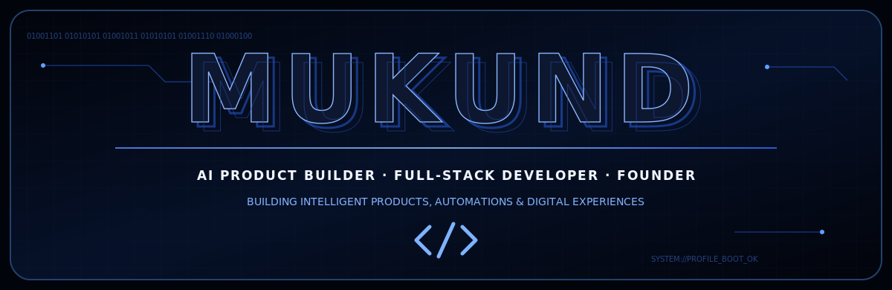
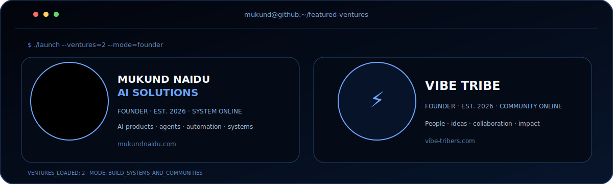

 

 

 

 

## Current build queue

- **AI Startup Intelligence Platform** — idea validation, competitor intelligence, MVP planning and launch workflows.
- **AI Business Automation Platform** — practical agents and automations for modern business operations.
- **Interactive 3D Digital Experience** — advanced creative development using motion and WebGL.

## 90-day mission

**3 flagship products · 9 complete applications · 18 focused experiments**

Every public repository will solve a clear problem and include a polished README, screenshots, deployment instructions and a live demo wherever practical.

### Contribution activity

**B.Tech CSE — Artificial Intelligence & Machine Learning**  
Dayananda Sagar University · Harohalli, Bengaluru · 2026–2030

`ideas → systems → impact`

