<table>
<tr>
<td valign="top"></td>
<td valign="top"></td>
</tr>
</table>

# Mukund Naidu

**AI Product Builder · Full-Stack Developer · Creative Technologist**

Building practical AI products, immersive digital experiences and intelligent systems that help modern businesses move faster.

 

 

## Building now

- **AI Startup Intelligence Platform** — idea validation, competitor intelligence, MVP planning and launch workflows.
- **AI Business Automation Platform** — practical agents and automations for modern business operations.
- **Interactive 3D Digital Experience** — an advanced creative development showcase built with motion and WebGL.

## 90-day build mission

**3 flagship products · 9 complete applications · 18 focused experiments**

The goal is not artificial activity. Every public repository should solve a clear problem, include a strong README, screenshots, a live demo where practical and a clean development history.

## Core toolkit

`TypeScript` · `JavaScript` · `Python` · `Next.js` · `React` · `Node.js` · `Express.js` · `Supabase` · `Tailwind CSS` · `shadcn/ui` · `Three.js` · `React Three Fiber` · `Spline` · `Framer Motion` · `GSAP` · `AI Agents` · `Automations` · `Git` · `GitHub` · `Vercel`

---

**B.Tech CSE — Artificial Intelligence & Machine Learning**  
Dayananda Sagar University · Harohalli, Bengaluru · 2026–2030

`ideas → systems → impact`

